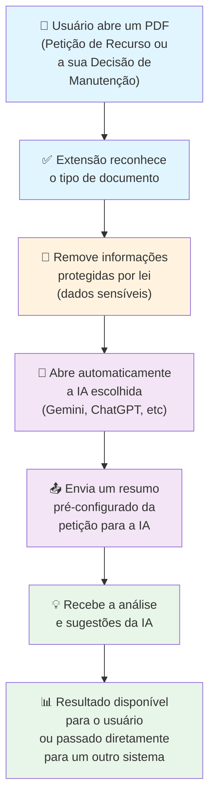

# Este trabalho objetivo encaminha resolução para o seguinte problema proposto:

## Como usar IA para acelerar o exame de marcas e patentes?
### Os seguintes condicionantes foram postos:
- Em prazo curto, menos de três meses;
- Usando solução gratuita, ou acessível aos examinadores;
- Respeitando a LGPD ([Lei Geral de Proteção de Dados Pessoais](https://www.planalto.gov.br/ccivil_03/_ato2015-2018/2018/lei/l13709.htm));
- Além destes, foi observado nos debates iniciais do grupo, que um desenvolvedor tinha dificuldade de apresentar alguma proposta, pois não tinha acesso direto aos documentos necessários, em função da especificidade do sistema SISCAP.

## A solução apresentada traz as seguintes vantagens:
1) Automação da anonimização de dados da LGPD, por meio de Tokenização Semântica Reversível. Este método, resumidamente, consiste em identificar os dados sensíveis, e trocá-los por strings de sentido vago, mas inteligíveis para as LLMs (IAs), por exemplo, trocar o nome da requerente: "João Pardal", por "requerente_1", no texto enviado para tratamento pela IA, o vai evitar ou diminuir a probabilidade do texto ser identificado e atribuído à algum processo específico.
2) Por ser uma unidade isolada, fora de um sistema maior, mais complexo, a solução presta-se para testes rápidos de prompts e IAs diferentes.
3) Contorna o problema de falta de acesso aos documentos do Siscap, pois trabalha com a leitura de pdfs, gerados pelo mesmo, e de forma independente dos sistema. Sendo útil tanto para Marcas, como para Patentes.

---

## Como Funciona?

---
## Limitações:

Este trabalho, em si, não é a solução do problema proposto, mas é um degrau para ele.

Inicialmente ,a proposta só abrange as petições de recurso contra o indeferimento de pedidos (de marca e patentes), além do documento oficial do INPI, de decisão destes recursos.

A escolha deste tipo de petição foi pautada, por ser ela o maior quantitativo de trabalho para os examinadores da CGREC, e os pareceres sobre eles, também representarem uma carga grande para os aprovadores, desta forma atingindo dois públicos diferenciados, em tarefas volumosas.

## Funcionalidades Principais

### 1️⃣ **Leitura Automática de Documentos**
- Identifica e processa petições de recurso
- Identifica e processa decisões sobre as petições de recurso
- *Futuramente*: Suporte para outros tipos de documentos

### 2️⃣ **Proteção de Dados Pessoais**
- Remove automaticamente informações sensíveis (nomes, CPF, e-mails, etc.)

### 3️⃣ **Integração com IA**
- Abre automaticamente a página html da Inteligência Artificial usada.
- Suporta múltiplas IAs: Gemini, ChatGPT, Claude, etc.
- Usuário escolhe sua IA preferida nas configurações.
- Permitir customização de prompts.

### 4️⃣ **Automação de Análise**
- Envia automaticamente um resumo da petição para a IA
- Não é necessário copiar/colar ou digitar manualmente
- A IA fornece análise, sugestões e parecer em segundos

---

## Próximos Passos

- Expandir para novos tipos de documentos
- Adicionar mais opções de Inteligência Artificial
